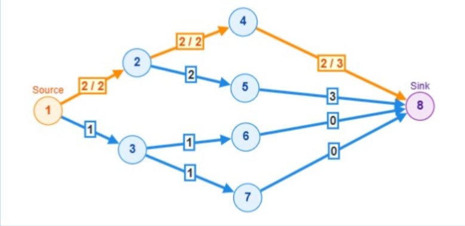

# Ficha de Acompanhamento: Modelagem e Rede de Fluxo

## 1. Resumo do Problema
O problema consiste em maximizar o pareamento de fatores primos compartilhados entre elementos de um conjunto de $n$ números. Recebemos uma lista de números e um conjunto de $m$ pares "válidos" (relações permitidas para pareamento). O objetivo é calcular o número máximo de vezes que podemos combinar fatores primos idênticos seguindo estritamente as ligações fornecidas pelas regras dos pares válidos.

## 2. Interpretação da Entrada e da Saída
* **Entrada:** * A primeira linha contém dois inteiros, $n$ (quantidade de números) e $m$ (quantidade de pares válidos).
  * A segunda linha contém os $n$ inteiros que formam a sequência de valores.
  * As $m$ linhas seguintes contêm, cada uma, dois inteiros $u$ e $v$, representando que é possível parear fatores do índice $u$ com fatores do índice $v$.
* **Saída:** * Um único número inteiro representando o fluxo máximo total global, que corresponde à quantidade máxima de pares de fatores primos que puderam ser combinados.

## 3. Modelagem da Rede de Fluxo
A estratégia do algoritmo resolve uma rede de fluxo separada de forma independente para **cada fator primo global** $p$ encontrado. 
* **Vértices:** Os vértices da rede representam os índices de $1$ a $n$, divididos de forma bipartida com base na paridade do índice.
  * **Conjunto da Esquerda:** Elementos cujos índices são **pares** (`i % 2 == 0`).
  * **Conjunto da Direita:** Elementos cujos índices são **ímpares** (`i % 2 != 0`).
* **Origem (S) e Sorvedouro (T):** * A **Origem ($s=0$)** atua como o provedor inicial dos fatores primos disponíveis nos elementos de índice par.
  * O **Sorvedouro ($t=n+1$)** atua como o coletor final dos fatores primos combinados nos elementos de índice ímpar.
* **Arestas e Capacidades:**
  * **Da Origem para Vértices Pares:** Uma aresta direcional com capacidade igual à potência (quantidade) do fator primo $p$ presente na decomposição daquele número.
  * **De Vértices Ímpares para o Sorvedouro:** Uma aresta com capacidade igual à potência do fator primo $p$ no número ímpar.
  * **Entre Vértices Pares e Ímpares (Pares Bons):** Se existe uma relação de par válido entre um índice par e um ímpar (e ambos contêm o fator primo $p$), cria-se uma aresta direcionada do Par para o Ímpar. A capacidade dessa aresta é limitada pela quantidade de fatores disponíveis no nó par.
* **Justificativa da Modelagem:** O particionamento em par/ímpar garante a estrutura do grafo bipartido. As capacidades controlam rigorosamente o limite de agrupamentos, impedindo que um fator seja "gasto" mais de uma vez.

## 4. Escolha do Algoritmo
O código-fonte analisado define uma classe chamada `FordFulkerson`. Contudo, internamente o algoritmo de busca de caminho aumentante (`hasAugmentingPath`) é implementado utilizando uma Fila (`Queue<Integer> queue = new LinkedList<>()`). 
* **Algoritmo de fato:** Trata-se do algoritmo de **Edmonds-Karp** (que é a especialização do Ford-Fulkerson que utiliza Busca em Largura / BFS).
* **Justificativa:** Esta escolha é a mais adequada para o problema. O uso da BFS garante a descoberta do caminho aumentante com o menor número de arestas, evitando anomalias de longo tempo de execução associadas à busca em profundidade (DFS) em redes com capacidades discrepantes. A complexidade fica garantida como $\mathcal{O}(V E^2)$.

## 5. Instância Pequena e Execução Manual
Abaixo demonstramos a lógica de iteração visualizando o conceito de um dos grafos na rede.

### Passo a Passo da Execução na Instância (Referência da Imagem)
* **Estado Inicial:** O grafo possui uma Origem (Source = 1) e um Sorvedouro (Sink = 8). As arestas apresentam capacidades e o fluxo inicial começa zerado.
* **Busca do Caminho Aumentante (BFS):** O algoritmo de Edmonds-Karp procura um caminho da origem ao sorvedouro onde haja capacidade residual maior que $0$. 
* **Caminho Selecionado (Em laranja):** O caminho encontrado é `1 -> 2 -> 4 -> 8`.
* **Identificação do Gargalo (Bottleneck):**
  * Aresta `1 -> 2`: Capacidade residual = 2
  * Aresta `2 -> 4`: Capacidade residual = 2
  * Aresta `4 -> 8`: Capacidade residual = 3
  * **Gargalo = $\min(2, 2, 3) = 2$.**
* **Atualização do Grafo Residual:**
  * O fluxo de valor $2$ é adicionado às arestas do caminho (`flow += delta`).
  * Nas arestas do grafo residual, a capacidade na direção original diminui em $2$, e arestas reversas (com capacidade $2$) são criadas (representando `flow -= delta`).
* **Próximas Iterações:** O algoritmo continua buscando novos caminhos (por exemplo, explorando `1 -> 3 -> ...`) até que nenhum vértice conectado ao Sorvedouro (8) possa ser alcançado com capacidade residual positiva.

## 6. Recuperação da Resposta Final
A resposta final (o fluxo máximo global) não requer reconstruir a composição da rede para visualização. Ela é simplesmente acumulada somando os **gargalos** encontrados de todos os caminhos aumentantes válidos (`value += bottle`), e isso se repete de forma somatória para os grafos gerados iterativamente para **cada número primo global**. O valor somado consolida o número total máximo de pares combinados que a questão requisitou.
